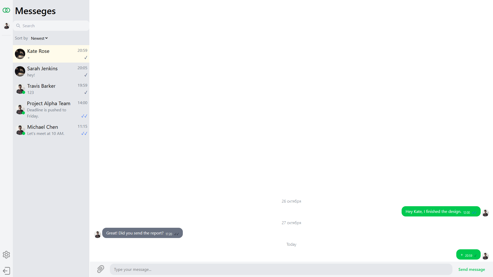

# 💬 React Messenger SPA

<div align="center">


**Современный мессенджер с имитацией Real-time взаимодействия, чистой архитектурой и фокусом на UX.**

[Открыть Демо](https://your-link-here.com) · [Сообщить о баге](https://github.com/M00N77/Messenger/issues) · [Предложить фичу](https://github.com/M00N77/Messenger/issues)

</div>

---

## 📖 О проекте

Это не просто To-Do лист, а сложная эмуляция реального рабочего процесса мессенджера. Проект решает задачу создания отзывчивого интерфейса (Optimistic UI) без наличия готового бэкенда.

> **Особенность:** Бэкенд эмулируется через асинхронные таймеры и слой абстракции над LocalStorage. Это позволяет ощутить "живое" взаимодействие (задержки сети, ответы бота) уже сейчас.

## 📸 Интерфейс

<!-- ВАЖНО: Убедись, что путь к картинке правильный. Обычно это ./public/screenshot.png -->


---

## ✨ Ключевые возможности

### ⚡ Эмуляция Real-time
*   **Smart Bot:** Асинхронная имитация собеседника с рандомизированной задержкой (Network Latency simulation).
*   **Auto-Scroll:** Умный скролл к новым сообщениям (как в Telegram).

### 📂 Работа с данными (Persistence)
*   **LocalStorage Sync:** Полная синхронизация состояния.
*   **Session Restore:** История переписок, активный чат и неотправленные черновики не теряются при перезагрузке.

### 🎛 Продвинутый UI/UX
*   **Сортировка:** Фильтрация чатов по новизне (`Newest`/`Oldest`).
*   **Live Preview:** Сайдбар отображает последнее сообщение, счетчик непрочитанных и статус онлайн.
*   **Visual Feedback:** Кастомные статусы сообщений (Sent/Read) и динамическая стилизация (`clsx`).

---

## 🛠 Технологический стек

| Сфера | Технологии | Зачем использовано? |
| :--- | :--- | :--- |
| **Core** | React 18 | Functional Components, Hooks (`useState`, `useEffect`, `useRef`). |
| **Styling** | Tailwind CSS | Быстрая верстка, Utility-first подход. |
| **Utils** | clsx | Условный рендеринг классов (читаемость кода). |
| **Data** | UUID | Генерация коллизионно-устойчивых ID. |
| **Build** | Vite | Мгновенный HMR и оптимизированная сборка. |

---

## 🏗 Архитектура проекта

Проект следует принципам **Separation of Concerns** (Разделение ответственности). Вдохновлено методологией *Bulletproof React*.

```text
src/
├── components/          # "Глупые" компоненты (UI)
│   ├── Chat/           # Окно переписки
│   ├── SideBar/        # Список чатов и навигация
│   └── shared/         # Переиспользуемые UI элементы (MessageItem, Avatar)
├── hooks/               # Кастомные хуки (Logic extraction)
├── utils/               # Чистые функции (formatTime, uuid)
├── App.jsx              # "Умный" контейнер (Business Logic Layer)
└── main.jsx             # Точка входа
**Ключевые решения:**
1.  **Container / Presentational:** Логика синхронизации и стейта вынесена в `AuthenticatedApp`, UI-компоненты получают только данные.
2.  **Derived State:** Мы не храним дубликаты данных. Сортировка и поиск вычисляются "на лету" перед рендером.
```
---

## 🎓 Чему я научился

В ходе разработки этого проекта я углубил знания в:
1.  **React Lifecycle:** Использование `useEffect` для эмуляции подписок и очистки таймеров (cleanup functions).
2.  **State Management:** Работа со сложными вложенными структурами данных и иммутабельное обновление стейта.
3.  **UX Engineering:** Понимание того, как задержки интерфейса влияют на восприятие пользователя, и реализация оптимистичных обновлений.

---

## 🚀 Быстрый старт

1.  **Клонировать репозиторий:**
    ```bash
    git clone https://github.com/M00N77/Messenger.git
    ```

2.  **Установить зависимости:**
    ```bash
    cd Messenger
    npm install
    ```

3.  **Запустить локально:**
    ```bash
    npm run dev
    ```

---

## 🤝 Contributing

Если у вас есть идеи по улучшению:
1.  Fork this repository.
2.  Create a feature branch (`git checkout -b feature/amazing-feature`).
3.  Commit changes (`git commit -m 'Add amazing feature'`).
4.  Push to branch (`git push origin feature/amazing-feature`).
5.  Open a Pull Request.

---

## 🗺 Roadmap

- [x] MVP (Чат, История, LocalStorage)
- [x] Сортировка и Фильтрация
- [ ] **Backend Integration** (Node.js + Socket.io / Firebase)
- [ ] **Audio API** (Звуки уведомлений)
- [ ] **TypeScript Migration**

---

<div align="center">

**Автор: M00N77**
</div>
<div align="center">
[GitHub Profile](https://github.com/M00N77)
</div>

